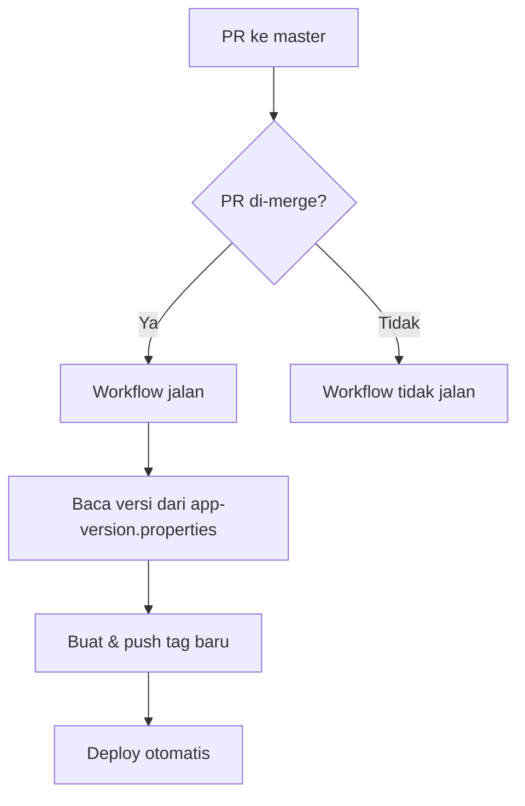

# 🔖 Git Tagging Guide & Automation

Ini adalah repositori yang berisi dokumentasi, skrip, dan contoh penggunaan **Git Tagging** untuk keperluan versioning dan release deployment (manual & otomatis).

---

## 📌 Apa itu Git Tagging?

Git tagging digunakan untuk menandai commit tertentu sebagai versi rilis (contoh: `v1.0.0`). Cocok digunakan dalam:
- CI/CD pipelines
- Release software
- Rollback versi
- Deployment otomatis berbasis tag

---

## 🚀 Perintah Dasar Git Tag

### Membuat Tag
```bash
# Annotated Tag (disarankan)
git tag -a v1.0.0 -m "Release versi 1.0.0"

# Lightweight Tag
git tag v1.0.0
```

### Push Tag ke Remote

#### Push satu tag
```sh
git push origin v1.0.0
```

#### Push semua tag
```sh
git push origin --tags
```

### 🗑️ Hapus Tag

#### Hapus tag di lokal
```sh
git tag -d v1.0.0
```

#### Hapus tag di remote
```sh
git push origin :refs/tags/v1.0.0
```

---

## ⚡️ Otomatisasi Tag & Deploy via GitHub Actions

### Alur Otomatisasi

1. **Buat Pull Request ke `master`**  
   Developer membuat PR dari branch feature ke `master`.

2. **Merge Pull Request**  
   Saat PR di-merge ke `master`, workflow GitHub Actions akan berjalan.

3. **Generate & Push Tag Otomatis**  
   Workflow membaca file `app-version.properties`, membuat tag baru (misal: `v1.0.4`), lalu push tag ke repository.

4. **Deploy Berdasarkan Tag**  
   Setelah tag berhasil dibuat, workflow melanjutkan ke proses deploy (dummy deploy pada contoh ini).

---

## 📈 Flow Otomatisasi Tagging



---

## 📂 Struktur Project

```sh
.
├── README.md
├── app-version.properties
├── .github
│   └── workflows
│       └── examples.yaml   # Workflow GitHub Actions
├── scripts
│   ├── auto-tag.sh         # Tag otomatis berdasarkan timestamp atau commit hash
│   └── tag-version.sh      # Tag manual dengan input versi
└── examples
    └── gitlab-ci.yml       # Contoh pipeline GitLab untuk release berbasis tag
```

---

**Catatan:**  
- Pastikan file `app-version.properties` selalu di-update sebelum merge ke `master`.
- Workflow hanya berjalan saat PR ke `master` di-merge (bukan di-close tanpa merge).

  
| Commit                                                | Hasil versi |
| ----------------------------------------------------- | ----------- |
| `fix: bug X`                                          | PATCH 0.2.1 |
| `feat: fitur baru`                                    | MINOR 0.3.0 |
| `feat!: breaking change` + `BREAKING CHANGE:` in body | MAJOR 1.0.0 |
